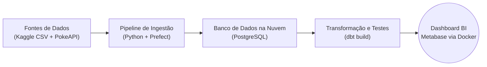

# Projeto de Pipeline de Dados End-to-End com Pokémon


## 📖 Sobre o Projeto

Este projeto demonstra a construção de um pipeline de dados completo (end-to-end), aplicando conceitos modernos de **Engenharia de Dados** e **DataOps**. O objetivo foi simular um ambiente de produção, desde a extração de dados brutos de múltiplas fontes até a criação de um dashboard analítico interativo.

Utilizando dados do universo Pokémon, o pipeline automatiza a ingestão, limpeza, transformação, teste e visualização dos dados, culminando em um dashboard que permite análises aprofundadas sobre os atributos e perfis de combate dos Pokémon.

## ✨ Destaques

* **Orquestração Robusta:** Uso do **Prefect** para gerenciar o fluxo de ingestão, garantindo a execução correta das tarefas, retentativas e observabilidade.
* **Transformação com Analytics Engineering:** Implementação de uma arquitetura de modelagem com **dbt**, separando os dados em camadas (`staging` e `marts`) e aplicando regras de negócio complexas.
* **Qualidade de Dados Garantida:** Testes automatizados com **dbt test** para validar a integridade, unicidade e consistência dos dados nos modelos finais.
* **Infraestrutura como Código:** Uso do **Docker** para provisionar o banco de dados PostgreSQL e a plataforma de BI Metabase, garantindo um ambiente de desenvolvimento reprodutível.
* **Automação e CI/CD:** Implementação de um workflow com **GitHub Actions** que executa o pipeline completo a cada `push` na branch `main`, garantindo a integração contínua.
* **Cloud Ready:** O pipeline se conecta a um banco de dados **PostgreSQL na nuvem**, com gerenciamento de segredos através de arquivos de ambiente (`.env`).

## 🛠️ Tech Stack

* **Orquestração de Pipeline:** [Prefect](https://www.prefect.io/)
* **Transformação de Dados:** [dbt (data build tool)](https://www.getdbt.com/)
* **Banco de Dados:** [PostgreSQL](https://www.postgresql.org/) (na nuvem, via Render)
* **Linguagem Principal:** Python
* **Contêineres:** [Docker](https://www.docker.com/)
* **CI/CD:** [GitHub Actions](https://github.com/features/actions)
* **Business Intelligence (BI):** [Metabase](https://www.metabase.com/)

## 📐 Arquitetura do Pipeline



## 📊 Preview do Dashboard


## ⚙️ Como Rodar o Projeto

Este projeto foi desenvolvido e testado em um ambiente **WSL 2 (Ubuntu)**.

### Pré-requisitos
* WSL 2 com Ubuntu
* Docker Desktop com integração WSL 2 ativada
* Python 3.11+
* Git

### Passos de Instalação e Execução

1.  **Crie uma Pasta Limpa (Recomendado):**
    Para evitar problemas com caminhos do Windows, crie o projeto em um local como `C:\dev\`.
    ```bash
    # No terminal WSL
    cd ~
    git clone [https://github.com/Bolinhx/dataops_poke.git](https://github.com/Bolinhx/dataops_poke.git)
    cd dataops_poke
    ```

2.  **Crie e Ative o Ambiente Virtual:**
    ```bash
    python3 -m venv venv
    source venv/bin/activate
    ```

3.  **Instale as Dependências:**
    ```bash
    pip install -r requirements.txt
    ```

4.  **Configure os Segredos (Variáveis de Ambiente):**
    * Crie uma cópia do arquivo de exemplo: `cp .env.example pokedb.env`.
    * Edite o arquivo `pokedb.env` e preencha com as suas credenciais do banco de dados PostgreSQL.

5.  **Execute o Pipeline de Ingestão (Prefect):**
    Este script irá ler os dados, chamar a API e popular o banco de dados na nuvem.
    ```bash
    python3 ingestions.py
    ```

6.  **Configure o Perfil do dbt:**
    * Certifique-se de que a pasta `~/.dbt/` existe (rode `dbt debug --config-dir` se necessário para criá-la).
    * Edite o arquivo `~/.dbt/profiles.yml` e aponte para as variáveis de ambiente, conforme o `profiles.yml.example`.

7.  **Execute a Transformação (dbt):**
    Navegue até a pasta do dbt e execute o `build`.
    ```bash
    cd poke_dbt
    dbt build
    ```
    Isso criará as views `stg_pokemon` e `mart_pokemon` no seu banco de dados.

8.  **Inicie os Serviços Docker:**
    * No PowerShell, inicie o contêiner do Metabase (certifique-se de ter construído a imagem `meu-metabase-custom` conforme as instruções do projeto).
    ```powershell
    docker start meu-metabase-custom # ou o comando docker run
    ```

9.  **Acesse o Dashboard:**
    * Abra o Metabase em **http://localhost:3000** e conecte-o ao seu banco de dados na nuvem.
