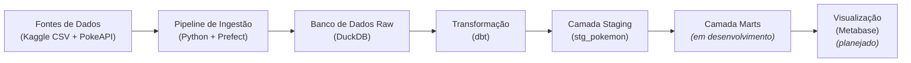

# Projeto de Pipeline de Dados com Pokémon (End-to-End)


## 📖 Sobre o Projeto

Este projeto foi criado como um exercício prático para aprender e aplicar os conceitos de **Engenharia de Dados** e **DataOps**. O objetivo é construir um pipeline de dados completo (end-to-end), desde a ingestão de dados de múltiplas fontes até a disponibilização de modelos limpos e prontos para análise.

O tema lúdico de Pokémon foi escolhido por ser universalmente reconhecido e por possuir uma riqueza de dados surpreendente, permitindo a aplicação de diversas técnicas de modelagem e transformação.

## 🛠️ Tech Stack

* **Orquestração de Pipeline:** [Prefect](https://www.prefect.io/)
* **Transformação de Dados:** [dbt (data build tool)](https://www.getdbt.com/)
* **Banco de Dados Analítico:** [DuckDB](https://duckdb.org/)
* **Linguagem Principal:** Python
* **CI/CD:** GitHub Actions *(planejado)*
* **Business Intelligence (BI):** Metabase *(planejado)*

## 📐 Arquitetura do Pipeline

O diagrama abaixo ilustra o fluxo de dados do projeto, desde as fontes até as camadas de análise.



## 🚀 Status do Projeto

O projeto está **em desenvolvimento**. As etapas concluídas até agora são:

- [x] **Etapa 1: Ingestão e Orquestração** - Pipeline com Prefect para extrair, enriquecer e carregar os dados brutos.
- [x] **Etapa 2: Modelagem (Camada Staging)** - Criação dos primeiros modelos com dbt para limpar e padronizar os dados brutos.
- [ ] **Etapa 3: Modelagem (Camada Marts)** - Criação de modelos de dados agregados e prontos para o consumo.
- [ ] **Etapa 4: Testes de Qualidade de Dados** - Implementação de testes no dbt para garantir a integridade dos dados.
- [ ] **Etapa 5: Automação (CI/CD)** - Criação de um workflow com GitHub Actions para rodar o pipeline automaticamente.
- [ ] **Etapa 6: Visualização** - Conexão com uma ferramenta de BI para criar um dashboard interativo.

## ⚙️ Como Rodar o Projeto Localmente

Siga os passos abaixo para executar o pipeline no seu ambiente.

### Pré-requisitos
* Python 3.9+
* Git
* Um editor de código como o VS Code
* (Opcional, mas recomendado) [DBeaver](https://dbeaver.io/) para visualizar o banco de dados.

### Passos de Instalação e Execução

1.  **Clone o Repositório:**
    ```bash
    git clone [https://github.com/seu-usuario/dataops-pokemon-pipeline.git](https://github.com/seu-usuario/dataops-pokemon-pipeline.git)
    cd dataops-pokemon-pipeline
    ```

2.  **Crie e Ative o Ambiente Virtual:**
    ```bash
    # Crie o ambiente
    python -m venv venv

    # Ative o ambiente (Windows)
    .\venv\Scripts\activate

    # Ative o ambiente (macOS/Linux)
    source venv/bin/activate
    ```

3.  **Instale as Dependências:**
    (Primeiro, certifique-se de que o arquivo `requirements.txt` está atualizado executando `pip freeze > requirements.txt` no seu terminal)
    ```bash
    pip install -r requirements.txt
    ```

4.  **Execute a Ingestão (Prefect):**
    Este script irá ler os dados, chamar a API e criar o banco de dados `pokemon_raw.db` com os dados brutos.
    ```bash
    python ingestions.py
    ```

5.  **Configure o Perfil do dbt:**
    O dbt precisa de um arquivo de perfil para saber como se conectar ao banco. Crie o arquivo `profiles.yml` no seu diretório de usuário (`C:\Users\seu_usuario\.dbt\` no Windows ou `~/.dbt/` no macOS/Linux) com o seguinte conteúdo, **ajustando o `path` para o local correto do seu projeto**:
    ```yaml
    meu_projeto_dbt: # Use o nome do seu projeto dbt
      target: dev
      outputs:
        dev:
          type: duckdb
          path: /caminho/completo/para/seu/projeto/dataops_poke/pokemon_raw.db
    ```

6.  **Execute a Transformação (dbt):**
    Navegue até a pasta do dbt e execute o comando `run`.
    ```bash
    cd meu_projeto_dbt
    dbt run
    ```
    Isso criará a view `stg_pokemon` com os dados limpos no seu banco de dados.

7.  **Verifique os Dados:**
    Use o DBeaver ou sua ferramenta de banco de dados preferida para se conectar ao arquivo `pokemon_raw.db` e explorar a tabela `pokemon_top_20` e a view `stg_pokemon`.

## 📂 Estrutura do Projeto
```
├── data/
│   └── pokemon.csv         # Dataset bruto
├── meu_projeto_dbt/
│   ├── models/
│   │   └── staging/
│   │       ├── sources.yml
│   │       └── stg_pokemon.sql # Modelo de staging
│   └── dbt_project.yml     # Configurações do projeto dbt
├── .gitignore              # Arquivos e pastas a serem ignorados pelo Git
├── ingestions.py           # Script de ingestão com Prefect
├── README.md               # Este arquivo
└── requirements.txt        # Dependências Python
```

## ⏭️ Próximos Passos
* Desenvolver a camada `marts` no dbt, com modelos de dados mais complexos e agregações.
* Implementar testes de singularidade, nulidade e relacionamentos no dbt.
* Automatizar a execução do pipeline com GitHub Actions.
* Criar um dashboard interativo no Metabase.
